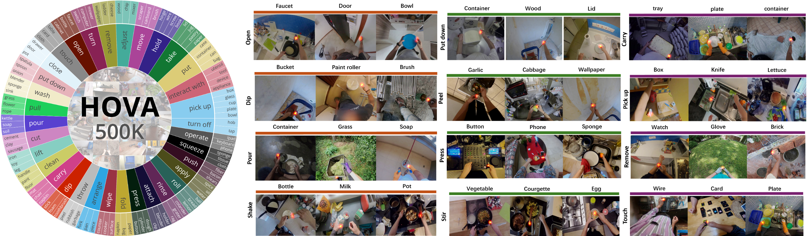

# GLOVER++: Unleashing the Potential of Affordance Learning from Human Behaviors for Robotic Manipulation

[Teli Ma](https://teleema.github.io/)<sup>1*</sup>, [Jia Zheng](https://scholar.google.com/citations?hl=zh-CN&user=wowRHOgAAAAJ)<sup>1*</sup>, [Zifan Wang](https://scholar.google.com/citations?user=GaJXZ-UAAAAJ&hl=en)<sup>1</sup>, [Ziyao Gao](https://scholar.google.com/citations?user=pLJfwc4AAAAJ&hl=en&oi=ao)<sup>1</sup>, [Jiaming Zhou](https://jiaming-zhou.github.io/)<sup>1</sup>, [Junwei Liang](https://junweiliang.me/index.html)<sup>1,2,#</sup>

\*equal contributions, \#corresponding author

<sup>1</sup>HKUST(GZ), <sup>2</sup>HKUST

<!-- <a href='https://arxiv.org/pdf/2505.11865'></a>
<a href='https://teleema.github.io/projects/GLOVER++/'></a>
<a href='https://huggingface.co/datasets/JiaaZ/HOVA-500K/tree/main'></a> -->

[[🌐 Project Page]](https://teleema.github.io/projects/GLOVER++/)  |  [[📄 GLOVER++ Paper]](https://arxiv.org/pdf/2505.11865) | [[📄 GLOVER Paper]](https://arxiv.org/pdf/2411.12286v2) |  [🤗 Huggingface Data](https://huggingface.co/datasets/JiaaZ/HOVA-500K/tree/main)  | [[📺 Video]](https://youtu.be/MDQccK681-k) | [[🤗 Pretrained Weights]](https://huggingface.co/JiaaZ/GLOVER_plus/tree/main)

## Overview
* GLOVER++ aims to distill actionable affordance knowledge from rich human videos, and demonstrates the effective transfer as an explicit representation for a variety of manipulation tasks.
* We contribute a large-scale affordance-annotated dataset—HOVA-500K, that provides the necessary scale and diversity to learn generalizable affordance representations. 
* We present GLOVER++, a global-to-local paradigm of affordance training policy based on HOVA-500K, showing fine-grained affordance representation and generalizable affordance reasoning capability. GLOVER++ achieves state-of-the-art performance in the HOVA-500K evaluation benchmark.
* Extensive applications in tasks like zero-shot manipulation, multi-task imitation learning, long-horizon and bimanual manipulation demonstrate the huge potential of HOVA-500K and GLOVER++.


## HOVA-500K Dataset

* We introduce HOVA-500K, a large-scale affordance-annotated dataset constructed from
existing human videos and images. The HOVA-500K comprises 500,000 meticulously annotated
images spanning 1,726 object categories and 675 action categories, creating a comprehensive taxon-
omy of human-object interactions. 



* Download the [HOVA-500K](https://huggingface.co/datasets/JiaaZ/HOVA-500K/tree/main) dataset, Use the following command to merge the dataset splits into a single .tar.gz file:
```
cat HANDAL/part_* > HANDAL.tar.gz
cat Ego4D/part_* > Ego4D.tar.gz
cat epic-100/part_* > epic-100.tar.gz
```

* Uncompress these .tar.gz files and organize them as follows:
```
├── HOVA-500K
│   ├── 3doi
│   │   ├── GT_gaussian
│   │   └── images
│   ├── Ego4D
│   │   ├── GT_gaussian
│   │   └── frames
│   ├── HANDAL
│   │   └── annotations
│   │   |    ├── GT_gaussian_train
│   │   |    └── GT_gaussian_test
|   │   └── images
│   └── epic-100
```
Note: the "annotations" files should be put in the same directory as the training code.


## Installation
1. Clone the repository:
```bash
git clone https://github.com/TeleeMa/GLOVER.git
cd GLOVER
```

2. Install dependencies: 

We use Python 3.9
```bash
pip install -r requirements.txt
```

3. Download pre-trained models:
- [LISA Plus 7B model](https://huggingface.co/Senqiao/LISA_Plus_7b) 
- [CLIP ViT-L/14 model](https://huggingface.co/openai/clip-vit-large-patch14)
- [SAM ViT-h](https://huggingface.co/HCMUE-Research/SAM-vit-h)
- Place them in the specified directories and configure the model paths in the training script.

## GLOVER/GLOVER++ Method

### Training 
Basic training command:
```
bash train_glover.sh
```

or Advanced training with GLOVER++:
```bash
bash train_glover_plus.sh
```

NOTE: Key training parameters must be set individually:
- `--version`: /path/to/LISA_Plus_7b
- `--vision-tower`: /path/to/clip-vit-large-patch14
- `--sam_vit_path`: /path/to/sam_vit_h_4b8939.pth (only for GLOVER++)
- `--dataset_dir`: /path/to/HOVA-500K datasets

When training is finished, to get the full model weight:
```
cd ./runs/glover(++)/ckpt_model && python zero_to_fp32.py . ../pytorch_model.bin
```

### Merge LoRA Weights
Merge the LoRA weights of pytorch_model.bin, save the resulting model to your desired path in Hugging Face format:
```
bash merge_weights.sh
```

### Evaluation
```
bash eval.sh
```
NOTE: Key evaluation parameters must be set individually:
- `--dataset_dir`: /path/to/HOVA-500K datasets
- `--version`: /path/to/GLOVER(++) model
- `--model_arch`: Choose from 'glover' or 'glover++'

### Inference
```
bash infer.sh
```

NOTE: Key inference parameters must be set individually:
- `--version`: Path to GLOVER(++) model
- `--model_arch`: Choose from 'glover' or 'glover++'
- `--image_path`: Path to input image
- `--objects`: Target objects(e.g., 'bottle,cup')
- `--actions`: Target actions(e.g., 'pick up,raise')

## Citation
If you find this project useful in your research, please consider citing:

```
@article{ma2025glover++,
  title={GLOVER++: Unleashing the Potential of Affordance Learning from Human Behaviors for Robotic Manipulation},
  author={Ma, Teli and Zheng, Jia and Wang, Zifan and Gao, Ziyao and Zhou, Jiaming and Liang, Junwei},
  journal={arXiv preprint arXiv:2505.11865},
  year={2025}
}
```

## Acknowledgement
-  We would like to thank the [LISA++](https://github.com/dvlab-research/LISA/tree/lisa_plus) and [SAM](https://github.com/facebookresearch/segment-anything) for their contributions. 
